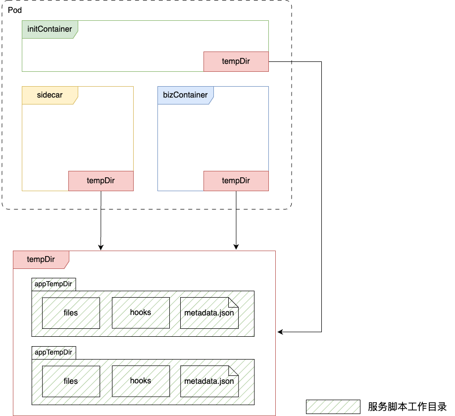
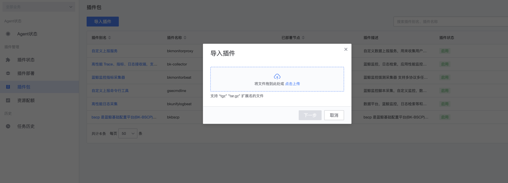
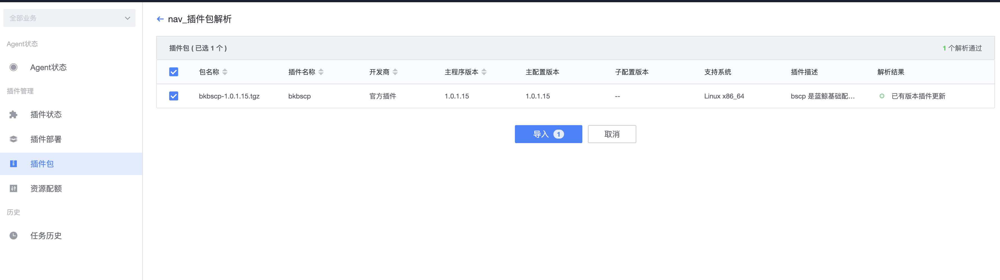
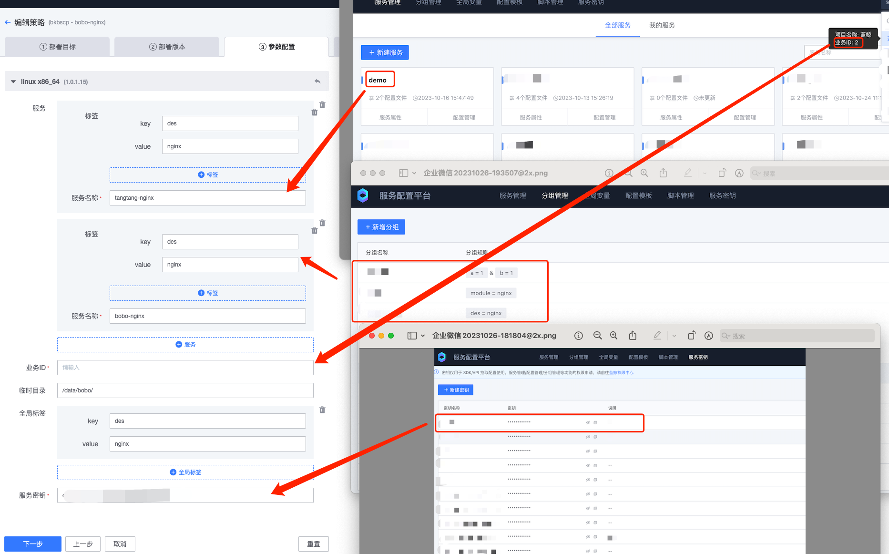
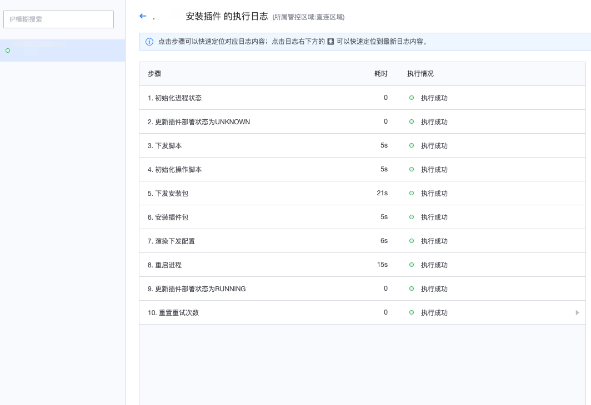

## initContainer/sidecar 配置方式：

### 命令行参数

```shell
# init-container
docker run bscp-init:latest --feed-addrs={feed_addr_host}:9510 --token=***** --biz=2 --app=bscp-demo --labels='{"env":"debug","region":"shenzhen"}'
# sidecar
docker run bscp-sidecar:latest --feed-addrs={feed_addr_host}:9510 --token=***** --biz=2 --app=bscp-demo --labels='{"env":"debug","region":"shenzhen"}'
```

参数详情：
- feed-addrs：订阅地址，必填
- biz：业务ID，必填
- app：服务名称，必填，多个服务以半角逗号`,`做分隔
- token：服务秘钥，必填
- labels：实例标签（选填）
- temp-dir：bscp 临时工作目录（选填，默认为 /data/bscp）

### 环境变量

```shell
# init-container
docker run -e feed_addrs={feed_addr_host}:9510 -e token=***** -e biz=2 -e app=bscp-demo -e labels='{"env":"debug","region":"shenzhen"}' bscp-init:latest
# sidecar
docker run -e feed_addrs={feed_addr_host}:9510 -e token=***** -e biz=2 -e app=bscp-demo -e labels='{"env":"debug","region":"shenzhen"}' bscp-sidecar:latest
```
环境变量详情：
- feed_addrs：订阅地址，必填
- biz：业务ID，必填
- app：服务名称，必填，多个服务以半角逗号`,`做分隔
- token：服务秘钥，必填
- labels：实例标签（选填）
- temp_dir：bscp 临时工作目录（选填，默认为 /data/bscp）

### 配置文件，支持 yaml/json 类型

启动参数 --config

```shell
# init-container
docker run bscp-init:latest --config {pathToFile.yaml}
# sidecar
docker run bscp-sidecar:latest --config {pathToFile.yaml}
```

Yaml 示例：

```yaml
# 订阅地址，必填
feed_addrs:
  - "{feed_addr_host}:9510"
# 业务ID，必填
biz: 1
# 服务秘钥，必填
token: "****************"
# 实例标签，选填
labels:
  - "region": "shenzhen"
  - "env": "prod"
# bscp 临时工作目录，选填
temp_dir: "/data/bscp"
# 拉取或监听的服务
apps:
  # 服务名称，必填
  - name: bscp-demo
    # 服务标签（将覆盖实例中相同key的标签），选填
    labels:
      - "env": "prod"
      - "app": "demo"
```

Json 示例：

```json
{
    "feed_addrs": [
        "{feed_addr_host}:9510"
    ],
    "biz": 1,
    "token": "****************",
    "labels": [
        {
            "region": "shenzhen"
        },
        {
            "env": "prod"
        }
    ],
    "temp_dir": "/data/bscp",
    "apps": [
        {
            "name": "bscp-demo",
            "labels": [
                {
                    "env": "prod"
                },
                {
                    "app": "demo"
                }
            ]
        }
    ]
}
```

**配置项优先级：配置文件 > 命令行参数 >  环境变量**

## 从环境变量中逐个获取标签

通过环境变量逐个获取 `labels_{key}={value}`

示例：
- labels_env=prod
- labels_app=demo

获取到的客户端实例标签如下：
- env:prod
- app:demo

> 如果设置了 `labels` 命令参数或者 `labels` 环境变量，从 `labels_{key}` 环境变量获取的key，将覆盖前两者同名 key 的标签

## 从标签文件中获取标签

通过配置项指定标签文件路径，从标签文件中获取标签，支持 json 和 yaml 格式
配置环境变量 labels_file=pathToFile.yaml

Yaml 示例：labels.yaml
```yaml
key1: value1
key2: value2
```

Json 示例：labels.json
```json
{
    "key1": "value1",
    "key2": "value2"
}
```

### 其他可选配置
#### pull/watch文件缓存配置相关
- 命令行配置
```bash
--file-cache-enabled         enable file cache or not (default true)
--file-cache-dir string      bscp file cache dir (default "/data/bscp/cache")
--cache-threshold-gb float   bscp file cache threshold gigabyte (default 2)
```
- 配置文件中配置，yaml示例
```yaml
# 文件缓存配置
file_cache:
  # 是否开启文件缓存，不配置时默认开启
  enabled: true
  # 缓存目录
  cache_dir: /data/bscp/cache
  # 缓存清理阈值，单位为GB，缓存目录达到该阈值时开始清理，按文件更新时间从最老的文件开始清理，直至达到设置的缓存保留比例为止
  threshold_gb: 2
```


## initContainer/sidecar 执行流程

1. initContainer 启动 / sidecar 监听到服务端版本发布事件
2. 准备 BSCP 临时目录 `tempDir`，默认为  `/data/bscp`
3. 准备服务临时目录：`appTempDir` : `{tempDir}/{biz_id}/{app_name}`
4. 保存前后置脚本到 `{appTempDir}/hooks/` 目录，文件名分别为 `pre-hook.sh/pre-hook.py`,  `post-hook.sh/post-hook.py` 
5. 执行前置脚本，如果状态码返回 0，则前置脚本执行成功；如果返回状态码为非 0，则前置脚本失败
6. 下载配置文件到临时目录 `{appTempDir}/files` 目录
7. 为配置文件设置权限信息
8. 执行后置脚本
9. 写入版本变更成功事件到哨兵文件 `{appTempDir}/metadata.json`

initContainer/sidecar 容器与业务容器协作关系如图：




## 传统主机部署方式：

### 编译插件包

#### 设置插件包版本

[project.yaml](../build/nodeman/project.yaml)

```yaml
name: bkbscp
version: 1.0.1.* (设置插件包版本号)

........

config_templates:
  - plugin_version: 1.0.1.* (设置插件包版本号)
    name: bkbscp.conf
    version: 1.0.1.* (设置插件包版本号)
```

#### make

```bash
make build_nodeman_plugin
```

插件包输出目录为 **build/nodeman/bkbscp.tar.gz**

### 插件包部署

#### 前置操作

为临时目录授权

```bash
chmod 660 /data/bscp
```

#### 上传插件包





#### 插件部署策略

#### 选择部署版本

#### 参数配置



#### 执行



##  
